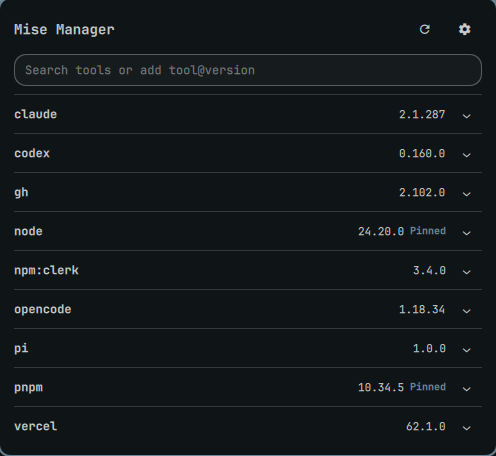

# Omarchy Mise Manager

A Quickshell bar widget for Omarchy 4.x that shows mise tool updates and manages global tool selections.



## Features

- Bar update count, checked every 30 minutes and on demand.
- Global tool inventory, active versions, and older installed versions.
- Update one tool or all outdated global tools.
- Edit mise upgrade settings: auto-prune and its wait (`upgrade.auto_prune`, `upgrade.prune_after`) and a release cooldown (`minimum_release_age`).
- Per tool: pin the installed version or go back to `latest`, and skip the release cooldown (`minimum_release_age_excludes`).
- Search mise's tool registry and install a tool globally. Enter `tool@version` to pick a release.
- Select an installed version globally, uninstall a global tool, or delete an unused installed version. Exact global version requests are marked Pinned. Destructive actions require confirmation; deletion appears only for versions reported by `mise ls --prunable`.

The plugin uses `mise` directly. Settings are written to `~/.config/mise/config.toml` with `mise settings`, so terminal `mise` commands follow them too. It never edits project configuration and does not need another service or dependency.

## Requirements

- Omarchy 4.x with Omarchy Shell (Quickshell).
- [mise](https://mise.jdx.dev), which Omarchy ships. No other dependency.

## Install

```bash
omarchy plugin add https://github.com/raavail-lasso/Omarchy-Mise-Manager.git --enable
```

The widget is placed in the right section of the bar. It works with the stock bar and other bars that use Omarchy's widget registry, including Islands Bar.

## Remove

```bash
omarchy plugin remove raavail.mise-manager
```

Removing the plugin leaves your mise tools and `~/.config/mise/config.toml` as they are. To keep the plugin installed but hide the widget, run `omarchy plugin disable raavail.mise-manager`.

## Controls

- Left click: open or close the manager.
- Middle click: refresh.
- The popup is one list of global tools. Rows with an update show `current → latest` and an Update button; `Update all` sits in the header.
- The search field filters your tools and shows matching registry tools as rows with Install. Enter `tool@version` to install a specific release.
- The gear button shows the settings: auto-prune and release cooldown. Expand a tool row to pin it or let it skip the cooldown.
- `Uninstall` removes the tool from global mise configuration and deletes versions no project uses; `Delete` removes one installed version. Both ask for confirmation.

The version labelled active is the one selected in global mise configuration. Project-local configurations may select another version when you enter their directories.

## Limits

Every mise command runs without a shell, from your home directory, under a deadline: 60 seconds for reads, 30 seconds for search, and 30 minutes for installs and upgrades, which may compile from source. Output is capped at 1 MiB; a run past the cap is stopped and reported as failed.

## License

MIT. See [LICENSE](LICENSE).
